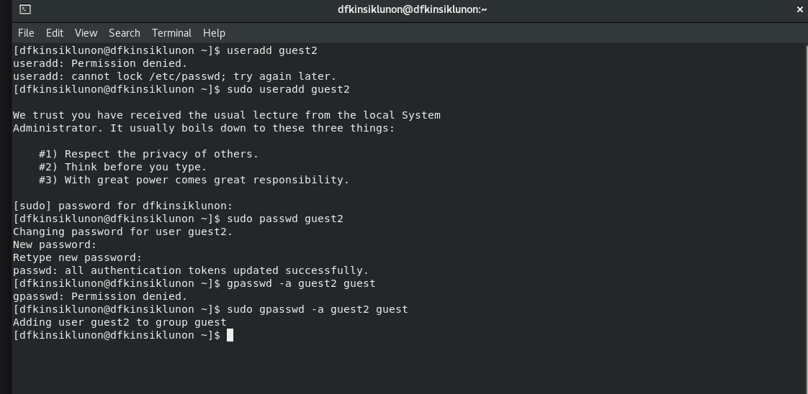
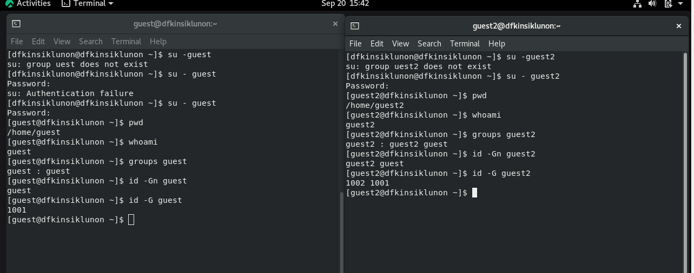
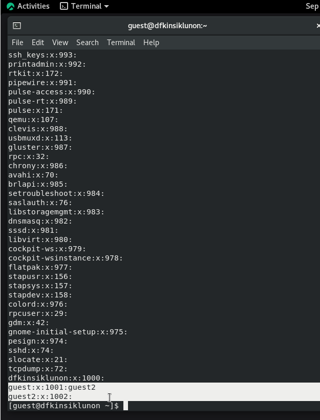
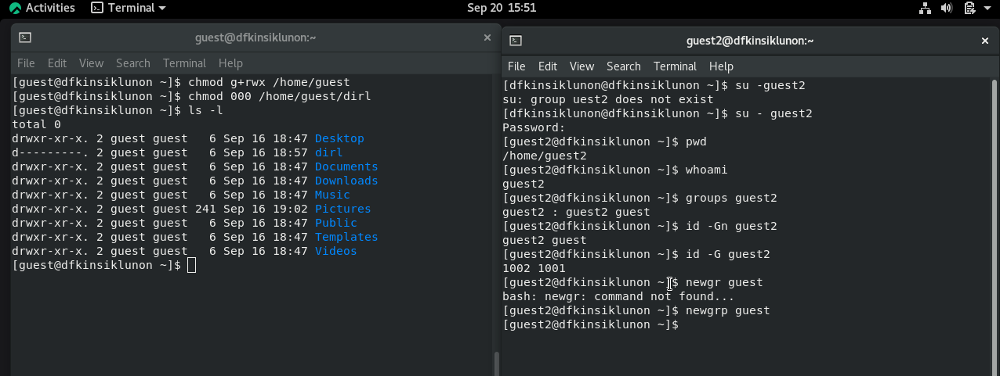

 ---
## Front matter
lang: ru-RU
title: Презентация по лабораторной работе № 3
subtitle: Основы Информационной безопасности
author: Кинсиклунон Доря Флора 
institute: Российский университет дружбы народов, Москва, Россия
date: 20.09.2023
## i18n babel
babel-lang: russian
babel-otherlangs: english

## Formatting pdf
toc: false
toc-title: Содержание
slide_level: 2
aspectratio: 169
section-titles: true
theme: metropolis
header-includes:
 - \metroset{progressbar=frametitle,sectionpage=progressbar,numbering=fraction}
 - '\makeatletter'
 - '\beamer@ignorenonframefalse'
 - '\makeatother'
---

# Информация

## Докладчик

:::::::::::::: {.columns align=center}
::: {.column width="70%"}

* Кинсиклунон Доря Флора
* студент группы НПМбд-02-20
* Факультет физико-математических и естественных наук
* Российский университет дружбы народов

:::
::::::::::::::

## Цель лабораторной работы

* Получение практических навыков работы в консоли с атрибутами файлов для
групп пользователей.
* Закрепление теоретических основ дискреционного разграничения доступа в современных системах с открытым кодом на базе ОС Linux.
* Составление соотношение права доступа и разрешенных операций

## Выполнение лабораторной работы
я создала нового пользователя "guest2" в операционной системе Linux, 
добавила его в группу "guest" и вошла под учетными записями "guest" и "guest2" на разных консолях.
Я подтвердила их домашние директории и имена пользователей, проверила их членство в группах и просмотрел файл "/etc/group",
обнаружив согласованную информацию.

Кроме того, я настроила разрешения для директории "/home/guest", разрешив доступ группы,
и удалила все атрибуты из директории "/home/guest/dir1". Эта работа предоставила практический опыт управления атрибутами файлов для групп пользователей в операционной системе Linux.

## Создание гостевого пользователя

я создала учётную запись пользователя guest2 с помощью команды “sudo useradd guest2” 
и задала пароль для этого пользователя командой “sudo passwd guest2”

 
я проверила в каких группах входят пользователи

## Результат

Это выходные данные, и отсюда мы можем видеть, что гостевой пользователь был создан и пароль установлен.

## Расширенные атрибуты для каждого каталога

* Для этого нам пришлось проверить доступный доступ к каждому каталогу.
* Внес несколько правок с помощью команды `chmod`
* Создавать, изменять и удалять файлы и каталоги

# Вывод

* В итоге выполнения данной лабораторной работы я приобрела практические навыки работы 
с атрибутами файлов для групп пользователей.