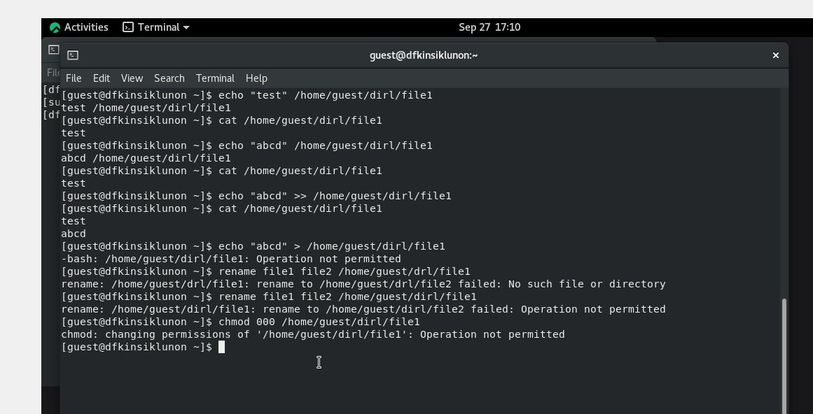

 ---
## Front matter
lang: ru-RU
title: Презентация по лабораторной работе № 4
subtitle: Основы Информационной безопасности
author: Кинсиклунон Доря Флора 
institute: Российский университет дружбы народов, Москва, Россия
date: 27.09.2023
## i18n babel
babel-lang: russian
babel-otherlangs: english

## Formatting pdf
toc: false
toc-title: Содержание
slide_level: 2
aspectratio: 169
section-titles: true
theme: metropolis
header-includes:
 - \metroset{progressbar=frametitle,sectionpage=progressbar,numbering=fraction}
 - '\makeatletter'
 - '\beamer@ignorenonframefalse'
 - '\makeatother'
---

# Информация

## Докладчик

:::::::::::::: {.columns align=center}
::: {.column width="70%"}

* Кинсиклунон Доря Флора
* студент группы НПМбд-02-20
* Факультет физико-математических и естественных наук
* Российский университет дружбы народов

:::
::::::::::::::

## Цель лабораторной работы

* Получение практических навыков работы в консоли с расширенными атрибутами файлов.
* Закрепление теоретических основ дискреционного разграничения доступа в современных системах с открытым кодом на базе ОС Linux.
* Составление соотношение права доступа и разрешенных операций

## Выполнение лабораторной работы
От имени пользователя guest определила расширенные атрибуты файла /home/guest/dir1/file1 командой “lsattr /home/guest/dir1/file1”. Командой
“chmod 600 /home/guest/dir1/file1” установила права, разрешающие чтение и
запись для владельца файла. При попытке использовать команду “chattr +a
/home/guest/dir1/file1” для установления расширенного атрибута “a” получила
отказ в выполнении операции

 
я установила расширенный атрибут “a” на
файл и от имени пользователям guest проверила правильность установления атрибута

Дозаписала в файл file1 слово “test” и, используя команду “cat /home/guest/dir1/file1” убедилась, 
что указанное ранее слово было успешно записано в наш файл. 
затем я аналогично записала в файл слово “abcd”. Далее попробовала стереть имеющуюся в файле информацию
но получила отказ. Попробовала переименовать файл командой “rename file1 file2 /home/guest/dirl/file1” и
изменить права доступа и также получила отказ

Сняла расширенный атрибут“a” с файла от имени суперпользователя и повторила операции,
которые ранее не получилось выполнить - теперь ошибок не было, операции были выполнены

установила расширенный атрибут “i” и повторила действия, которые выполняла
ранее. В данном случае файл можно было только прочитать, а изменить/записать
в него что-то, переименовать и изменить его атрибуты - нельзя

# Вывод

В ходе выполнения данной лабораторной работы я получила практические
навыки работы в консоли с расширенными атрибутами файлов, на практике
опробовала действие расширенных атрибутов “a” и “i”.